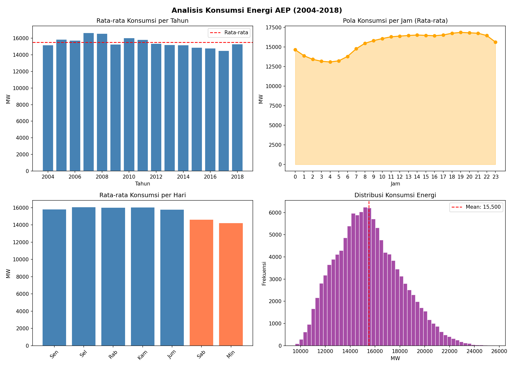

# Analisis Data Energi Listrik AEP (Kaggle Dataset)

Analisis data konsumsi energi listrik per jam dari perusahaan AEP (American Electric Power) menggunakan Python.

## Dataset
- Sumber: Kaggle — Hourly Energy Consumption
- Periode: 2004 - 2018
- Total data: 121,273 jam pengukuran

## Insight yang Ditemukan
- Konsumsi tertinggi terjadi pada jam 16-17 sore
- Konsumsi terendah pada jam 3-4 pagi
- Sabtu & Minggu konsumsi lebih rendah 8% dari hari kerja
- Puncak konsumsi tahunan terjadi di 2007-2008

## Teknologi
- Python 3.9
- pandas
- matplotlib

## Grafik Hasil Analisis

